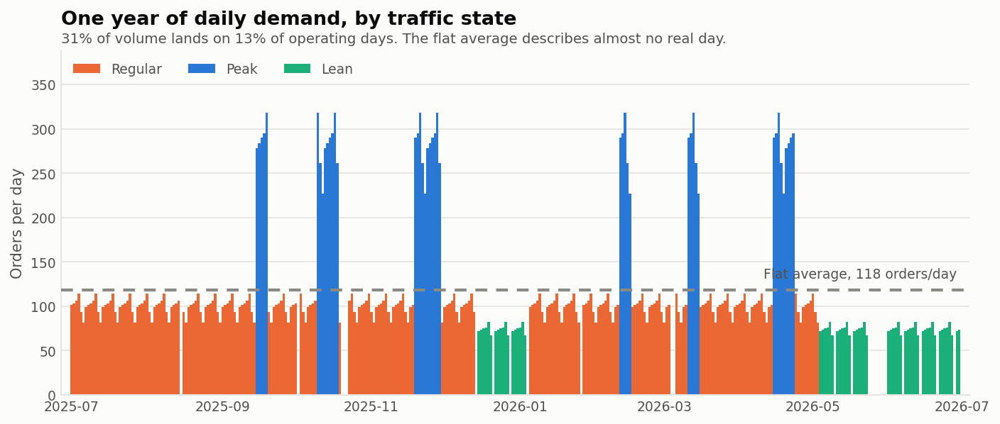
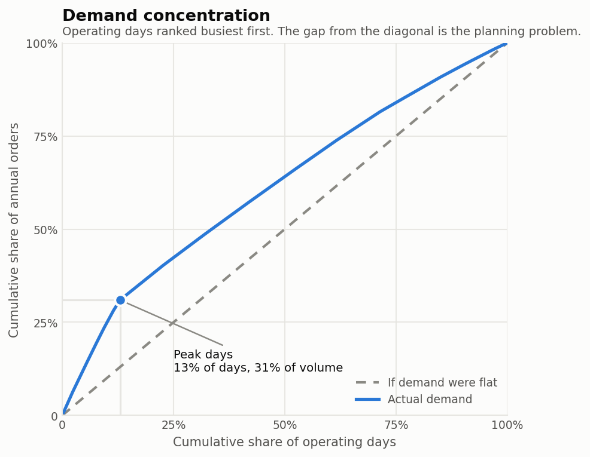
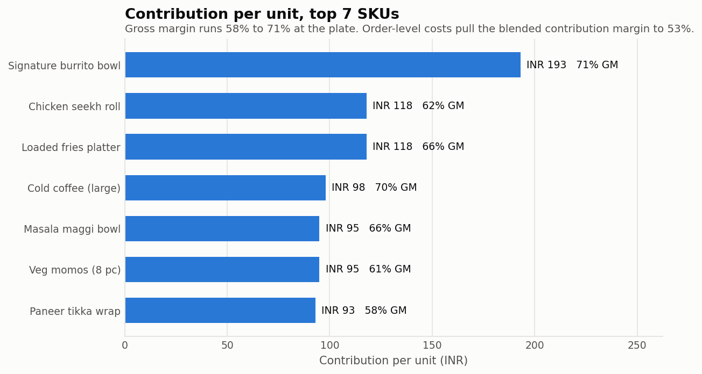
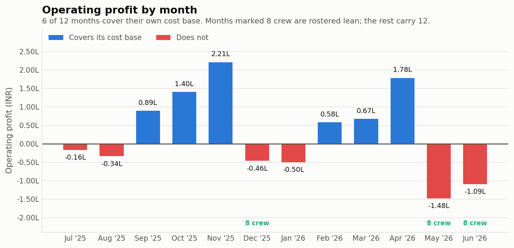
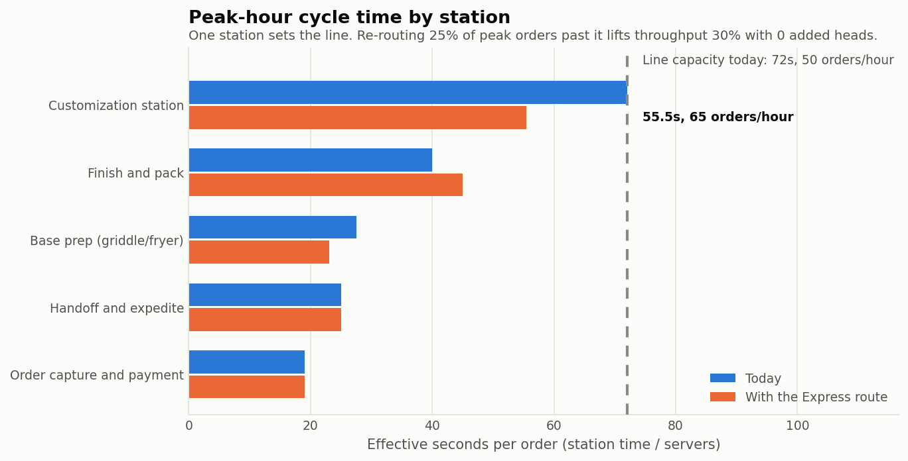
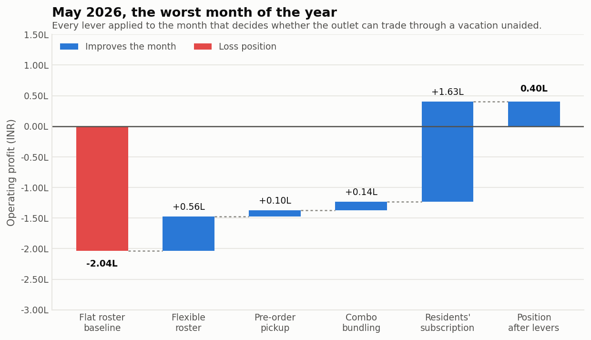

# Campus-QSR

Unit economics and throughput optimization for a campus quick-service restaurant.
MBA787M course project, Prof. Suman Saurabh.

A flat daily-average forecast hides where a QSR actually makes or loses money:
which hours are the bottleneck, which SKUs carry the P&L, and where headcount is
genuinely the constraint versus where it is not. This repository rebuilds the
picture around those questions and ships the model that produces it, so every
figure below can be traced to an input and re-run.

```
python3 scripts/run_analysis.py     # writes outputs/
python3 tests/test_claims.py        # 37/37 claims verified
```

## Headline results

| | |
|---|---|
| Annual demand | 40,155 orders across 339 operating days |
| Demand concentration | 31.0% of volume on 13.0% of operating days |
| Top 7 SKUs | INR 93 to 193 contribution per unit, 58% to 71% gross margin |
| Blended contribution margin | 53.2% on an AOV of INR 238.85 |
| Break-even | 1,904 orders/month against an INR 2.42L fixed base |
| Peak bottleneck | Customization station, 72s per order, 50 orders/hour |
| Express line | 64.9 orders/hour, up 29.7%, at zero incremental headcount |
| Flexible roster | 12 to 8 crew in lean months, INR 1.68L saved per year |



## Demand: segmented, not flat

Flat-average forecasting was replaced with a segmented demand model across three
calendar-driven traffic states: peak, regular, and lean. Each date in the
academic year is classified by rule (exam weeks, fests and placement weeks are
peak; vacations are lean), closed days are removed, and demand is built per
operating day as `base x state multiplier x day-of-week factor`.

That model sizes annual demand at 40,155 orders and surfaces the constraint that
actually matters: **31% of volume concentrates in 13% of operating days**, a peak
day carrying 2.4 times its share of the calendar.

The flat average it replaces would have planned to 118 orders a day and
understated a peak day by 139%. Seasonality, not average daily throughput, is the
real planning problem, and it dominates the weekly rhythm by roughly three to
one.

| State | Operating days | Annual orders | Orders/day | Share of days | Share of volume |
|---|---|---|---|---|---|
| Peak | 44 | 12,434 | 282.6 | 13.0% | 31.0% |
| Regular | 233 | 23,126 | 99.3 | 68.7% | 57.6% |
| Lean | 62 | 4,595 | 74.1 | 18.3% | 11.4% |



## Unit economics: bottom-up, by SKU

Per-SKU unit economics were built for the top 7 products: **INR 93 to 193
contribution per unit at 58% to 71% gross margin**. Those seven items are 78% of
units but **89% of menu contribution**, which is what ranks the menu by P&L
weight rather than by popularity.



Two margin layers are kept deliberately separate, because collapsing them is what
makes every SKU look like it earns its gross margin:

- **SKU gross margin**, price less recipe cost at the plate, decides which items
  are worth protecting when capacity is scarce.
- **Order contribution margin**, which also carries packaging, consumables,
  wastage, payment processing, aggregator commission and the thin tail menu,
  decides the break-even.

The second sits below every individual gross margin in the first. The walk from
one to the other:

| Line | Per order (INR) | Running margin |
|---|---|---|
| Average order value | 238.85 | |
| Recipe cost at the plate | -87.27 | 63.5% |
| Packaging | -8.00 | 60.1% |
| Consumables | -3.00 | 58.9% |
| Wastage and spoilage | -5.97 | 56.4% |
| Payment processing | -2.39 | 55.4% |
| Aggregator commission | -5.16 | **53.2%** |

Combined with a monthly cohort-level P&L, this gives a **break-even of 1,904
orders/month against a 53.2% contribution margin**, and identifies which months
and which SKUs carry annual profitability rather than assuming all of them do
equally.

**Six of twelve months cover their own cost base.** Including each month's
rostered crew, a session month must clear 3,227 orders and a lean month 2,786.
November alone contributes more operating profit than the four weakest months
destroy. On an annual view the outlet clears INR 95.9L of revenue for INR 3.5L of
operating profit, a 3.7% margin, which is thin enough that the off-peak levers
below are the difference between viable and not.



## The peak-hour bottleneck

The throughput bottleneck was diagnosed at the customization station
specifically, not the kitchen as a whole. Modelling the line as serial stations
with parallel servers, capacity is set by the slowest single station:

| Station | Servers | Effective cycle | Station capacity | Utilisation at line limit |
|---|---|---|---|---|
| Order capture and payment | 2 | 19.0s | 189.5/hr | 26% |
| Base prep | 2 | 27.5s | 130.9/hr | 38% |
| **Customization station** | 1 | **72.0s** | **50.0/hr** | **100%** |
| Finish and pack | 1 | 40.0s | 90.0/hr | 56% |
| Handoff and expedite | 1 | 25.0s | 144.0/hr | 35% |

Every station except one runs below 56% utilisation at the line's limit. The
kitchen has ample labour minutes; one station does not. That is the argument
against the intuitive response of hiring for the rush, because a head added
anywhere but the bottleneck changes nothing.

Against peak-hour demand of 62 orders, the line serves 50 and turns away 12.

The proposed intervention is an **Express fixed-recipe SKU line**, a deliberate
trade of personalization for service velocity at peak. Express orders bypass the
customization dialogue but still take 6 seconds there for lid and garnish, draw a
pre-batched base from a hold cabinet, and add 20 seconds at finish and pack. The
work is rerouted across existing stations, not added to them.

Projected impact: **peak-hour throughput from 50.0 to 64.9 orders/hour, up 29.7%,
at zero incremental headcount.** Seven people on the line in both scenarios. That
clears peak demand outright and recovers roughly 537 orders a year, INR 1.28L of
revenue. The constraint was process design, not staffing.

Two things keep the case honest. Express is sized at 25% of peak orders against
an express-eligible menu mix of 39%, so it does not depend on full adoption. And
the constraint does not disappear, it moves: finish and pack becomes the next
limit at 80 orders/hour, which is the headroom available before the question
returns.



## Off-peak: cost structure and demand

Peak and off-peak are different problems. At peak the constraint is capacity, so
the lever is process design. Off-peak the constraint is demand against a fixed
cost base, so the levers are cost flexibility and demand stimulation.

**A flexible cost structure**, cutting variable staffing from **12 to 8 crew** in
lean months. Three months qualify (December, May, June), releasing 4 crew each at
INR 14,000, for **INR 1.68L a year**, which is 5.8% of the annual fixed base.

**An off-peak demand-stimulation roadmap**, each instrument sized on its own
terms:

- **Pre-order pickup slots.** A 4% lift on lean volume, worth INR 0.30L of
  contribution. The more valuable effect is at peak, where shifting 8% of orders
  out of the rush cuts peak-hour demand from 62 to 57 orders and buys capacity
  with no capital.
- **Combo bundling** to lift attach rate and AOV. Modelled as a priced attach
  rather than a basket-wide discount: pricing a 70% gross margin cold coffee from
  INR 140 to INR 99 lifts units per order **1.55 to 1.72**, AOV **+7.1% to INR
  255.68**, contribution per order **+6.9%**, and drops break-even by **123
  orders/month**. The mechanic matters more than the headline here. A discount
  spread across the whole basket was modelled first and came out
  contribution-negative, because the incremental unit carries only average mix
  margin while the discount applies to everything.
- **A residents' subscription** to cover fixed costs through vacation periods. At
  INR 1,499 for 20 credits and 68% redemption, each subscriber contributes INR
  584, so **415 subscribers (11.9% of residents) cover the entire fixed base**.
  At a more conservative 8% penetration it covers 68% of it.

Applied to May, the worst month of the year, the levers move the position from a
INR 2.04L loss on a flat roster to INR 0.40L positive:



## What the model does not claim

- Demand is deterministic with no intra-day arrival distribution. Peak-hour load
  is a fixed share of the day, adequate for sizing a bottleneck but not for
  predicting queue length.
- Throughput uses mean cycle times. Variability at a bottleneck costs real
  capacity, so 64.9 orders/hour is an upper bound rather than a forecast.
- Nothing models whether customers accept a fixed recipe, which is the genuine
  commercial risk in the Express intervention.
- The uplift percentages for pickup and bundling are assumptions, not
  measurements, and are the softest inputs here. The robust subscription output
  is the break-even penetration, not the assumed take-up.

`docs/methodology.md` states each of these in full, alongside how every figure is
derived.

## Repository layout

```
config/assumptions.yaml     Every input. Nothing is hard-coded in the modules.
src/campus_qsr/
  assumptions.py            Typed loader with validation
  calendar_model.py         Traffic-state classification and daily demand
  sku_economics.py          Per-SKU economics and the margin bridge
  pnl.py                    Monthly cohort P&L, break-even, concentration
  throughput.py             Station cycle times, bottleneck, Express scenario
  offpeak.py                Roster flex, pickup, bundling, subscription
  charts.py                 Six figures, light and dark
  report.py                 Orchestration and output writing
scripts/run_analysis.py     Entry point
tests/test_claims.py        37 assertions, one per headline claim
docs/methodology.md         Derivations, and what the model does not do
outputs/                    Generated tables, figures and summary.md
```

## Reproducing

```bash
pip install -r requirements.txt
python3 scripts/run_analysis.py
python3 tests/test_claims.py
```

`outputs/summary.md` carries every figure with its supporting table. Eleven CSVs
land beside it, from the daily calendar to the station-level throughput model.

Every number in this README is computed rather than typed in, and
`tests/test_claims.py` asserts each headline claim against the model. Changing an
assumption that breaks a claim fails the suite rather than quietly changing the
README.

## Author

Siddharth Jaiswal
